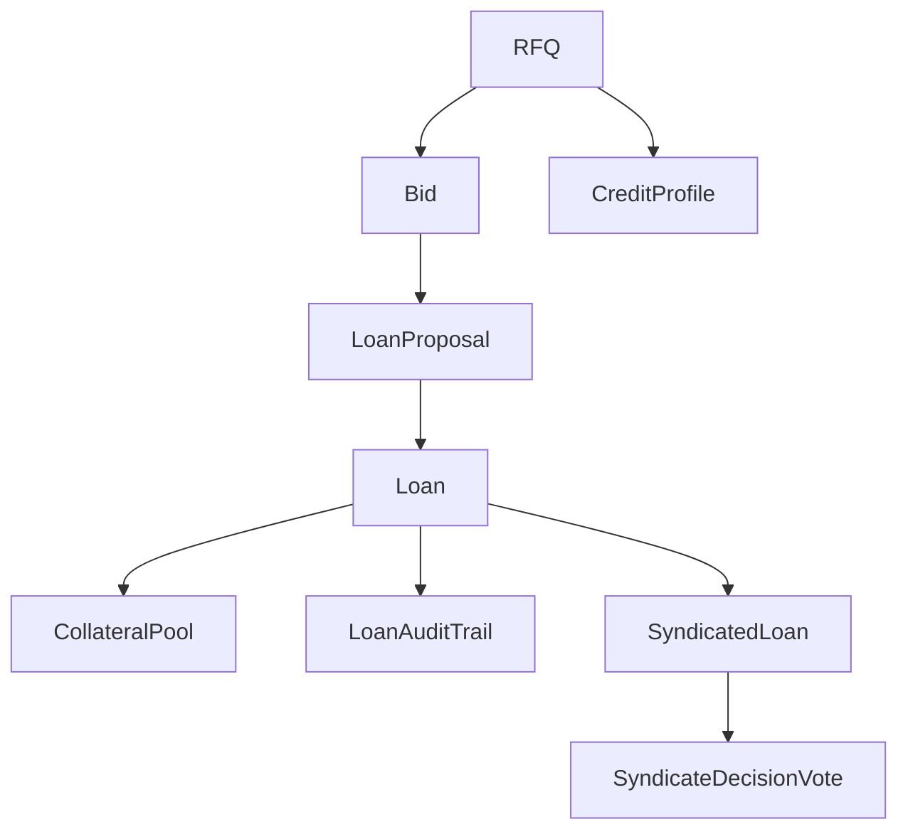

# DAML Smart Contracts

Aegis RFQ is built on DAML (Digital Asset Modeling Language) smart contracts running on Canton Network. DAML provides privacy-preserving, multi-party workflows with strong guarantees.

## Why DAML?

- **Privacy-First**: Observer patterns control who sees what data
- **Multi-Party**: Native support for workflows requiring multiple signatures
- **Type-Safe**: Strong typing prevents runtime errors
- **Auditable**: Complete audit trails built into the ledger
- **Interoperable**: Canton Network enables cross-network transactions

## Contract Architecture



## Core Contracts

### RFQ Module

The RFQ module implements confidential Request for Quote workflows.

**Templates:**
- `RFQ`: Borrower's loan request with selected lenders
- `Bid`: Lender's confidential offer
- `LoanProposal`: Intermediate state after bid acceptance
- `Loan`: Active loan with repayment schedule

**Key Features:**
- Confidential bidding (lenders can't see each other's bids)
- Time-based expiration
- Multi-lender selection
- Atomic bid acceptance

[View RFQ Contract Details →](/daml/rfq)

### Credit Module

Credit scoring and risk assessment for borrowers.

**Templates:**
- `CreditProfileContract`: Borrower's credit history
- `RiskAssessment`: Lender's risk evaluation
- `PortfolioRisk`: Lender's portfolio analysis
- `CreditInquiry`: Request for credit information
- `CreditInsurance`: Credit default insurance
- `CreditGuarantee`: Third-party guarantees

[View Credit Contract Details →](/daml/credit)

### Collateral Module

Collateral management with automated margin calls and liquidation.

**Templates:**
- `CollateralPool`: Locked collateral for a loan
- `SubstitutionRequest`: Request to swap collateral
- `CollateralLiquidation`: Liquidation process
- `LiquidationSettlement`: Final settlement

[View Collateral Contract Details →](/daml/collateral)

### Syndication Module

Multi-lender syndicated loan structures.

**Templates:**
- `SyndicatedLoan`: Loan with multiple lenders
- `SyndicateDecisionVote`: Voting mechanism
- `SyndicateFormation`: Syndicate assembly process
- `SyndicateReport`: Performance reporting

[View Syndication Contract Details →](/daml/syndication)

### Yield Module

Liquidity pools and yield generation.

**Templates:**
- `LiquidityPool`: Multi-participant lending pool
- `LPToken`: Tradeable pool position tokens
- `YieldOptimizer`: Automated yield strategies
- `StakingRewards`: Long-term staking incentives
- `PerformanceBonus`: Performance-based rewards

[View Yield Contract Details →](/daml/yield)

### Secondary Market Module

Loan trading and ownership transfers.

**Templates:**
- `LoanListing`: Loan listed for sale
- `LoanOffer`: Buyer's offer on a loan
- `SecondaryLoanTransfer`: Ownership transfer
- `TransferSettlement`: Transfer completion
- `LoanValuation`: Independent valuation
- `BorrowerNotification`: Notify borrower of transfer

[View Secondary Market Contract Details →](/daml/secondary-market)

### Aegis Platform Module

Platform-level operations and treasury management.

**Templates:**
- `AegisPlatform`: Main platform contract
- `AssetBalance`: Party asset balances
- `LiquiditySupport`: Emergency liquidity provision

[View Aegis Platform Contract Details →](/daml/aegis)

### Audit Log Module

Comprehensive audit trails for compliance.

**Templates:**
- `PlatformAuditLog`: Platform-wide events
- `LenderAuditLog`: Lender-specific events
- `BorrowerAuditLog`: Borrower-specific events
- `LoanAuditTrail`: Loan lifecycle events
- `PoolAuditLog`: Pool activity logs
- `ComplianceAuditLog`: Compliance events
- `ActivityMonitor`: Real-time monitoring
- `ComplianceAlert`: Compliance alerts
- `PlatformEscalation`: Platform escalations
- `ComplianceEscalation`: Compliance escalations

[View Audit Log Contract Details →](/daml/audit)

## Privacy Patterns

### Observer Pattern

Control who can see contract data:

```haskell
template RFQ with
    borrower: Party
    selectedLenders: [Party]
  where
    signatory borrower
    observer selectedLenders  -- Only selected lenders can see
```

### Confidential Bidding

Lenders submit bids that only the borrower can see:

```haskell
template Bid with
    borrower: Party
    lender: Party
  where
    signatory lender
    observer borrower  -- Only borrower sees the bid
```

### Multi-Party Execution

Require multiple parties to authorize actions:

```haskell
choice AcceptLoan: ContractId Loan
  controller borrower, lender  -- Both must sign
  do
    create Loan with ...
```

## Development Workflow

### 1. Build Contracts

```bash
daml build
```

### 2. Run Tests

```bash
daml test
```

### 3. Generate TypeScript Bindings

```bash
daml codegen js
```

Bindings are generated to `backend/daml.js/`

### 4. Start Ledger

```bash
daml start
```

This starts:
- DAML Ledger (port 6865)
- JSON API (port 7575)
- Navigator (port 7500)

## Testing

All contracts include comprehensive test scenarios:

```haskell
testRFQWorkflow = scenario do
  alice <- getParty "Alice"
  bob <- getParty "Bob"
  
  -- Create RFQ
  rfqCid <- submit alice do
    create RFQ with ...
  
  -- Submit bid
  bidCid <- submit bob do
    exercise rfqCid SubmitBid with ...
  
  -- Accept bid
  proposalCid <- submit alice do
    exercise rfqCid AcceptBid with
      bidContractId = bidCid
  
  -- Accept loan
  loanCid <- submit alice do
    exercise proposalCid AcceptLoan
  
  return loanCid
```

## Type System

DAML's strong type system prevents errors:

```haskell
-- Custom types
data LoanStatus
  = Active
  | Current
  | Delinquent
  | Default
  | Repaid
  deriving (Eq, Show)

data AssetType
  = BTC
  | ETH
  | USDC
  | USDT
  | DAI
  deriving (Eq, Show)

-- Ensure constraints
template Loan with
    principal: Decimal
    interestRate: Decimal
  where
    ensure
      principal > 0.0 &&
      interestRate >= 0.0 &&
      interestRate <= 1.0
```

## Integration with Backend

The backend integrates with DAML via the JSON API:

```typescript
// Query contracts
const rfqs = await damlService.queryContracts({
  templateIds: [getTemplateId('RFQ')]
}, authToken);

// Exercise choice
await damlService.exerciseChoice({
  templateId: getTemplateId('RFQ'),
  contractId: rfqContractId,
  choice: 'SubmitBid',
  argument: {
    bidId: 'BID-001',
    lender: 'Bob',
    offeredAmount: '1000000.00',
    interestRate: '0.08'
  }
}, authToken);
```

## Next Steps

- [RFQ Contract](/daml/rfq) - Detailed RFQ workflow
- [Credit Contract](/daml/credit) - Credit scoring system
- [API Reference](/api) - Backend API integration
- [Getting Started](/getting-started) - Set up development environment
