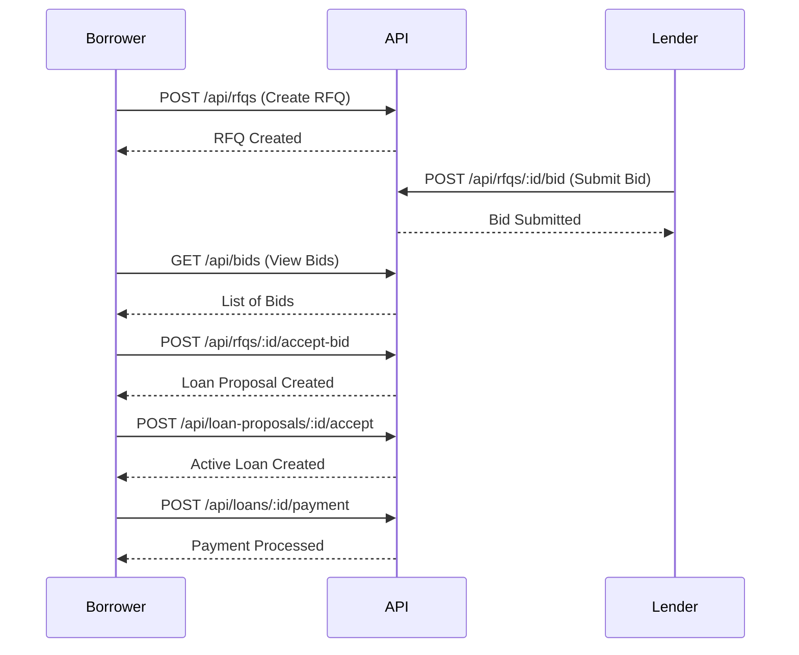

# RFQ Management API

The RFQ (Request for Quote) API enables borrowers to create loan requests and lenders to submit confidential bids. This module implements privacy-preserving workflows where competing lenders cannot see each other's offers.

## Base Endpoint

```
/api/rfqs
```

## Endpoints

### List RFQs

Get all RFQs visible to the authenticated party.

```http
GET /api/rfqs
```

**Response:**

```json
{
  "success": true,
  "data": [
    {
      "contractId": "00abc123...",
      "rfqId": "RFQ-2024-001",
      "borrower": "Alice",
      "loanAmount": "1000000.00",
      "interestRateRange": {
        "min": "0.05",
        "max": "0.15"
      },
      "duration": "365",
      "collateralAsset": "BTC",
      "collateralAmount": "1200000.00",
      "selectedLenders": ["Bob", "Charlie"],
      "status": "Active",
      "expirationDate": "2024-12-31T23:59:59Z",
      "createdAt": "2024-01-01T00:00:00Z"
    }
  ]
}
```

### Get RFQ by ID

Retrieve a specific RFQ by its ID.

```http
GET /api/rfqs/:rfqId
```

**Parameters:**
- `rfqId` (path): The RFQ identifier

**Response:**

```json
{
  "success": true,
  "data": {
    "contractId": "00abc123...",
    "rfqId": "RFQ-2024-001",
    "borrower": "Alice",
    "loanAmount": "1000000.00",
    "interestRateRange": {
      "min": "0.05",
      "max": "0.15"
    },
    "duration": "365",
    "collateralAsset": "BTC",
    "collateralAmount": "1200000.00",
    "selectedLenders": ["Bob", "Charlie"],
    "status": "Active",
    "expirationDate": "2024-12-31T23:59:59Z",
    "createdAt": "2024-01-01T00:00:00Z"
  }
}
```

### Create RFQ

Create a new Request for Quote.

```http
POST /api/rfqs
```

**Request Body:**

```json
{
  "rfqId": "RFQ-2024-001",
  "borrower": "Alice",
  "loanAmount": "1000000.00",
  "interestRateRange": {
    "min": "0.05",
    "max": "0.15"
  },
  "duration": "365",
  "collateralAsset": "BTC",
  "collateralAmount": "1200000.00",
  "selectedLenders": ["Bob", "Charlie"],
  "expirationDate": "2024-12-31T23:59:59Z"
}
```

**Response:**

```json
{
  "success": true,
  "data": {
    "contractId": "00abc123...",
    "rfqId": "RFQ-2024-001",
    "status": "Active"
  }
}
```

**Validation Rules:**
- `loanAmount` must be positive
- `collateralAmount` must meet minimum collateral ratio (120%)
- `interestRateRange.max` cannot exceed 25%
- `selectedLenders` must not be empty
- `expirationDate` must be in the future

### Submit Bid

Lender submits a confidential bid on an RFQ.

```http
POST /api/rfqs/:contractId/bid
```

**Parameters:**
- `contractId` (path): The RFQ contract ID

**Request Body:**

```json
{
  "bidId": "BID-2024-001",
  "lender": "Bob",
  "lenderProfile": {
    "lenderId": "LENDER-001",
    "name": "Bob's Lending",
    "creditRating": "AAA",
    "totalCapital": "10000000.00",
    "availableCapital": "5000000.00"
  },
  "offeredAmount": "1000000.00",
  "interestRate": "0.08",
  "terms": "Standard terms apply"
}
```

**Response:**

```json
{
  "success": true,
  "message": "Bid submitted successfully"
}
```

### Accept Bid

Borrower accepts a lender's bid, creating a loan proposal.

```http
POST /api/rfqs/:contractId/accept-bid
```

**Parameters:**
- `contractId` (path): The RFQ contract ID

**Request Body:**

```json
{
  "bidContractId": "00def456..."
}
```

**Response:**

```json
{
  "success": true,
  "message": "Bid accepted, loan proposal created",
  "data": {
    "proposalContractId": "00ghi789..."
  }
}
```

### Cancel RFQ

Cancel an active RFQ.

```http
POST /api/rfqs/:contractId/cancel
```

**Parameters:**
- `contractId` (path): The RFQ contract ID

**Request Body:**

```json
{
  "reason": "No longer needed"
}
```

**Response:**

```json
{
  "success": true,
  "message": "RFQ cancelled successfully"
}
```

### Extend Expiration

Extend the expiration date of an RFQ.

```http
POST /api/rfqs/:contractId/extend
```

**Parameters:**
- `contractId` (path): The RFQ contract ID

**Request Body:**

```json
{
  "newExpirationDate": "2025-01-31T23:59:59Z"
}
```

**Response:**

```json
{
  "success": true,
  "message": "RFQ expiration extended"
}
```

## Bids

### List Bids

Get all bids for a specific RFQ (borrower only).

```http
GET /api/bids?rfqId=RFQ-2024-001
```

**Query Parameters:**
- `rfqId` (optional): Filter by RFQ ID

**Response:**

```json
{
  "success": true,
  "data": [
    {
      "contractId": "00def456...",
      "bidId": "BID-2024-001",
      "rfqId": "RFQ-2024-001",
      "lender": "Bob",
      "offeredAmount": "1000000.00",
      "interestRate": "0.08",
      "status": "Pending",
      "submittedAt": "2024-01-02T00:00:00Z"
    }
  ]
}
```

### Withdraw Bid

Lender withdraws their bid.

```http
POST /api/bids/:contractId/withdraw
```

**Parameters:**
- `contractId` (path): The bid contract ID

**Request Body:**

```json
{
  "reason": "Changed lending strategy"
}
```

**Response:**

```json
{
  "success": true,
  "message": "Bid withdrawn successfully"
}
```

### Modify Bid

Lender modifies their existing bid.

```http
POST /api/bids/:contractId/modify
```

**Parameters:**
- `contractId` (path): The bid contract ID

**Request Body:**

```json
{
  "newInterestRate": "0.07",
  "newTerms": "Updated terms"
}
```

**Response:**

```json
{
  "success": true,
  "message": "Bid modified successfully"
}
```

## Loan Proposals

### List Loan Proposals

Get all loan proposals for the authenticated party.

```http
GET /api/loan-proposals
```

**Response:**

```json
{
  "success": true,
  "data": [
    {
      "contractId": "00ghi789...",
      "proposalId": "PROP-2024-001",
      "borrower": "Alice",
      "lender": "Bob",
      "loanAmount": "1000000.00",
      "interestRate": "0.08",
      "status": "Pending",
      "createdAt": "2024-01-03T00:00:00Z"
    }
  ]
}
```

### Accept Loan Proposal

Borrower accepts a loan proposal, creating an active loan.

```http
POST /api/loan-proposals/:contractId/accept
```

**Parameters:**
- `contractId` (path): The loan proposal contract ID

**Response:**

```json
{
  "success": true,
  "message": "Loan proposal accepted, active loan created",
  "data": {
    "loanContractId": "00jkl012..."
  }
}
```

## Loans

### List Loans

Get all active loans for the authenticated party.

```http
GET /api/loans
```

**Response:**

```json
{
  "success": true,
  "data": [
    {
      "contractId": "00jkl012...",
      "loanId": "LOAN-2024-001",
      "borrower": "Alice",
      "lender": "Bob",
      "principal": "1000000.00",
      "outstandingBalance": "950000.00",
      "interestRate": "0.08",
      "status": "Active",
      "startDate": "2024-01-04T00:00:00Z",
      "maturityDate": "2025-01-04T00:00:00Z"
    }
  ]
}
```

### Make Payment

Borrower makes a payment on an active loan.

```http
POST /api/loans/:contractId/payment
```

**Parameters:**
- `contractId` (path): The loan contract ID

**Request Body:**

```json
{
  "paymentAmount": "50000.00",
  "principalPortion": "45000.00",
  "interestPortion": "5000.00"
}
```

**Response:**

```json
{
  "success": true,
  "message": "Payment processed successfully",
  "data": {
    "newBalance": "905000.00"
  }
}
```

### Make Early Repayment

Borrower pays off the entire loan early.

```http
POST /api/loans/:contractId/early-repayment
```

**Parameters:**
- `contractId` (path): The loan contract ID

**Request Body:**

```json
{
  "repaymentAmount": "905000.00"
}
```

**Response:**

```json
{
  "success": true,
  "message": "Loan repaid in full"
}
```

## Code Examples

### TypeScript/JavaScript

```typescript
import axios from 'axios';

const api = axios.create({
  baseURL: 'https://api.aegis-rfq.com',
  headers: {
    'Authorization': `Bearer ${token}`,
    'Content-Type': 'application/json'
  }
});

// Create RFQ
const createRFQ = async () => {
  const { data } = await api.post('/api/rfqs', {
    rfqId: 'RFQ-2024-001',
    borrower: 'Alice',
    loanAmount: '1000000.00',
    interestRateRange: {
      min: '0.05',
      max: '0.15'
    },
    duration: '365',
    collateralAsset: 'BTC',
    collateralAmount: '1200000.00',
    selectedLenders: ['Bob', 'Charlie'],
    expirationDate: '2024-12-31T23:59:59Z'
  });
  
  console.log('RFQ created:', data);
};

// Submit bid
const submitBid = async (contractId: string) => {
  const { data } = await api.post(`/api/rfqs/${contractId}/bid`, {
    bidId: 'BID-2024-001',
    lender: 'Bob',
    lenderProfile: {
      lenderId: 'LENDER-001',
      name: "Bob's Lending",
      creditRating: 'AAA',
      totalCapital: '10000000.00',
      availableCapital: '5000000.00'
    },
    offeredAmount: '1000000.00',
    interestRate: '0.08',
    terms: 'Standard terms apply'
  });
  
  console.log('Bid submitted:', data);
};
```

### Python

```python
import requests

class AegisRFQClient:
    def __init__(self, token):
        self.base_url = 'https://api.aegis-rfq.com'
        self.headers = {
            'Authorization': f'Bearer {token}',
            'Content-Type': 'application/json'
        }
    
    def create_rfq(self, rfq_data):
        response = requests.post(
            f'{self.base_url}/api/rfqs',
            json=rfq_data,
            headers=self.headers
        )
        return response.json()
    
    def submit_bid(self, contract_id, bid_data):
        response = requests.post(
            f'{self.base_url}/api/rfqs/{contract_id}/bid',
            json=bid_data,
            headers=self.headers
        )
        return response.json()

# Usage
client = AegisRFQClient(token='your-jwt-token')

rfq = client.create_rfq({
    'rfqId': 'RFQ-2024-001',
    'borrower': 'Alice',
    'loanAmount': '1000000.00',
    'interestRateRange': {
        'min': '0.05',
        'max': '0.15'
    },
    'duration': '365',
    'collateralAsset': 'BTC',
    'collateralAmount': '1200000.00',
    'selectedLenders': ['Bob', 'Charlie'],
    'expirationDate': '2024-12-31T23:59:59Z'
})

print('RFQ created:', rfq)
```

### cURL

```bash
# Create RFQ
curl -X POST https://api.aegis-rfq.com/api/rfqs \
  -H "Authorization: Bearer $TOKEN" \
  -H "Content-Type: application/json" \
  -d '{
    "rfqId": "RFQ-2024-001",
    "borrower": "Alice",
    "loanAmount": "1000000.00",
    "interestRateRange": {
      "min": "0.05",
      "max": "0.15"
    },
    "duration": "365",
    "collateralAsset": "BTC",
    "collateralAmount": "1200000.00",
    "selectedLenders": ["Bob", "Charlie"],
    "expirationDate": "2024-12-31T23:59:59Z"
  }'

# Submit bid
curl -X POST https://api.aegis-rfq.com/api/rfqs/$CONTRACT_ID/bid \
  -H "Authorization: Bearer $TOKEN" \
  -H "Content-Type: application/json" \
  -d '{
    "bidId": "BID-2024-001",
    "lender": "Bob",
    "lenderProfile": {
      "lenderId": "LENDER-001",
      "name": "Bobs Lending",
      "creditRating": "AAA",
      "totalCapital": "10000000.00",
      "availableCapital": "5000000.00"
    },
    "offeredAmount": "1000000.00",
    "interestRate": "0.08",
    "terms": "Standard terms apply"
  }'
```

## Error Handling

### Common Errors

**400 Bad Request - Invalid collateral ratio:**
```json
{
  "success": false,
  "error": "Insufficient collateral ratio: 1.10. Minimum required: 1.20"
}
```

**400 Bad Request - Interest rate too high:**
```json
{
  "success": false,
  "error": "Interest rate too high: 30.00%. Maximum allowed: 25.00%"
}
```

**404 Not Found:**
```json
{
  "success": false,
  "error": "RFQ not found"
}
```

**403 Forbidden:**
```json
{
  "success": false,
  "error": "Only the borrower can accept bids"
}
```

## Workflow Example

Complete RFQ to Loan workflow:



## Next Steps

- [Credit System API](/api/credit) - Credit scoring and risk assessment
- [Collateral API](/api/collateral) - Collateral management
- [Syndication API](/api/syndication) - Multi-lender loans
