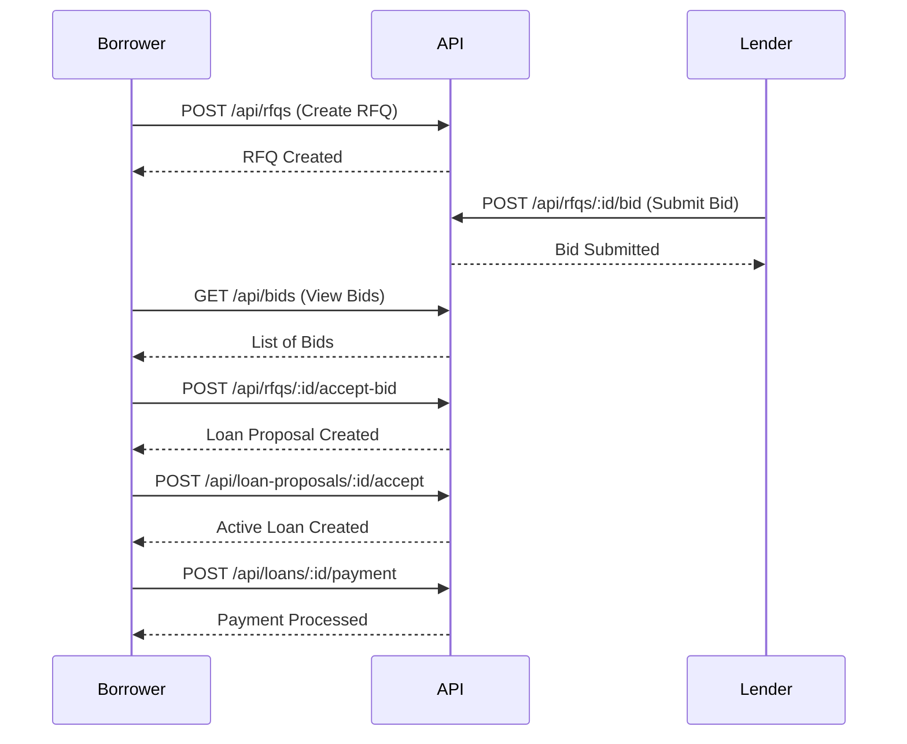

# RFQ Workflows

## Complete RFQ to Loan Flow



## Step-by-Step Guide

### 1. Borrower Creates RFQ

```typescript
const rfq = await api.post('/api/rfqs', {
  rfqId: 'RFQ-2024-001',
  borrower: 'Alice',
  loanAmount: '1000000.00',
  interestRateRange: { min: '0.05', max: '0.15' },
  duration: '365',
  collateralAsset: 'BTC',
  collateralAmount: '1200000.00',
  selectedLenders: ['Bob', 'Charlie'],
  expirationDate: '2024-12-31T23:59:59Z'
});
```

### 2. Lenders Submit Bids

```typescript
// Bob submits bid
const bobBid = await api.post(`/api/rfqs/${rfq.data.contractId}/bid`, {
  bidId: 'BID-BOB-001',
  lender: 'Bob',
  offeredAmount: '1000000.00',
  interestRate: '0.08'
});

// Charlie submits bid
const charlieBid = await api.post(`/api/rfqs/${rfq.data.contractId}/bid`, {
  bidId: 'BID-CHARLIE-001',
  lender: 'Charlie',
  offeredAmount: '1000000.00',
  interestRate: '0.07'
});
```

### 3. Borrower Reviews Bids

```typescript
const bids = await api.get(`/api/bids?rfqId=RFQ-2024-001`);
console.log('Available bids:', bids.data);
```

### 4. Borrower Accepts Best Bid

```typescript
const proposal = await api.post(
  `/api/rfqs/${rfq.data.contractId}/accept-bid`,
  { bidContractId: charlieBid.data.contractId }
);
```

### 5. Borrower Accepts Loan Proposal

```typescript
const loan = await api.post(
  `/api/loan-proposals/${proposal.data.proposalContractId}/accept`
);
```

### 6. Borrower Makes Payments

```typescript
const payment = await api.post(
  `/api/loans/${loan.data.loanContractId}/payment`,
  {
    paymentAmount: '50000.00',
    principalPortion: '45000.00',
    interestPortion: '5000.00'
  }
);
```

## Error Handling

```typescript
try {
  const rfq = await api.post('/api/rfqs', rfqData);
} catch (error) {
  if (error.response?.status === 400) {
    console.error('Validation error:', error.response.data.error);
  } else if (error.response?.status === 401) {
    console.error('Authentication required');
  } else {
    console.error('Unexpected error:', error);
  }
}
```

## Best Practices

1. **Always validate input** before sending to API
2. **Handle errors gracefully** with user-friendly messages
3. **Store contract IDs** for future operations
4. **Monitor RFQ expiration** dates
5. **Verify collateral ratios** meet requirements
6. **Use proper authentication** tokens
